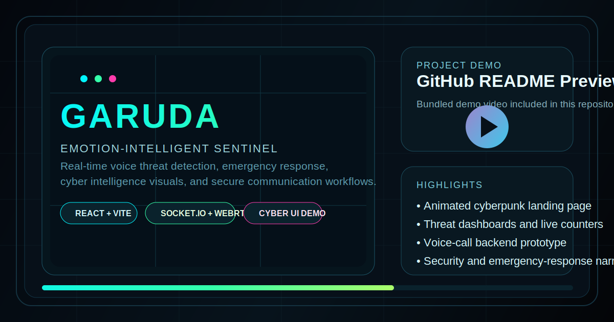

# GARUDA

<div align="center">

[](./docs/media/garuda-demo.mp4)

### Emotion-Intelligent Sentinel for Real-Time Voice Threat Detection

A cinematic cyber-defense project that combines a high-impact React showcase with a real-time voice communication prototype powered by WebRTC and Socket.IO.

[Watch Demo Video](./docs/media/garuda-demo.mp4) | [Tech Stack](#tech-stack) | [Run Locally](#run-locally)


</div>

---

## Overview

GARUDA is built as a cyber-intelligence showcase around voice-based threat detection, emotional distress analysis, and emergency-response storytelling. The repository combines a polished futuristic landing experience with a working voice-call prototype that gives the concept technical depth.

## Demo

The repository includes the project demo here:

- [GARUDA demo video](./docs/media/garuda-demo.mp4)

For the cleanest GitHub presentation, the banner at the top of this README links directly to the demo video.

## Highlights

| Area | What stands out |
| --- | --- |
| Visual design | Matrix rain, animated counters, scan lines, glowing panels, custom cursor |
| Product story | Threat detection, emotion analysis, distress recognition, emergency response |
| Frontend showcase | React, TypeScript, Vite, Tailwind CSS, shadcn/ui |
| Real-time prototype | Express, Socket.IO, WebRTC, audio sharing flow |
| Portfolio value | Strong fit for public GitHub presentation, demos, and hackathons |

## Project Structure

```text
.
|-- garuda-sentinel-core/
|-- amritapuri_test/
|   |-- voice-call-webiste/
|-- amritapuri_first/
|-- docs/
|   |-- garuda-demo-poster.svg
|   `-- media/
|       `-- garuda-demo.mp4
|-- .gitignore
`-- README.md
```

## Main Parts

### `garuda-sentinel-core`

This is the primary GitHub-facing app and the strongest part of the project presentation.

- Cinematic landing page
- Secure-portal hero section
- Voice analysis workflow
- Industry application cards
- Threat dashboard visuals
- Technology and security storytelling
- Testimonials and metrics

### `amritapuri_test/voice-call-webiste`

This is the functional communication prototype behind the concept.

- Room-based call flow
- Host approval system
- WebRTC signaling
- Audio sharing support
- Secure recording and metadata utilities

### `amritapuri_first`

This folder contains earlier prototype material and legacy static assets.

## Tech Stack

- React
- TypeScript
- Vite
- Tailwind CSS
- shadcn/ui
- Node.js
- Express
- Socket.IO
- WebRTC

## Run Locally

### Frontend showcase

```bash
cd garuda-sentinel-core
npm install
npm run dev
```

Available at `http://localhost:8080`

### Voice-call prototype

```bash
cd amritapuri_test/voice-call-webiste
npm install
npm start
```

Available at `http://localhost:3002`

## Public Repo Notes

- The root folder is organized as a multi-project workspace.
- `garuda-sentinel-core` is the main showcase app.
- `docs/media/garuda-demo.mp4` keeps the GitHub demo asset in a predictable place.
- The top README banner is intentionally designed to make the repo feel more like a polished product page than a raw code dump.

## Author

Built as a concept-driven cyber-defense experience inspired by vigilance, protection, and rapid response.
