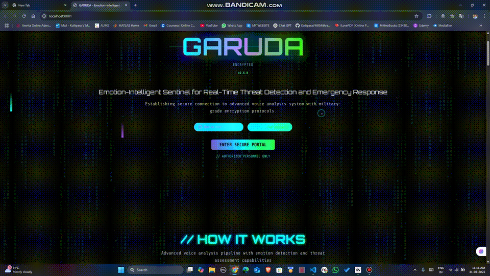
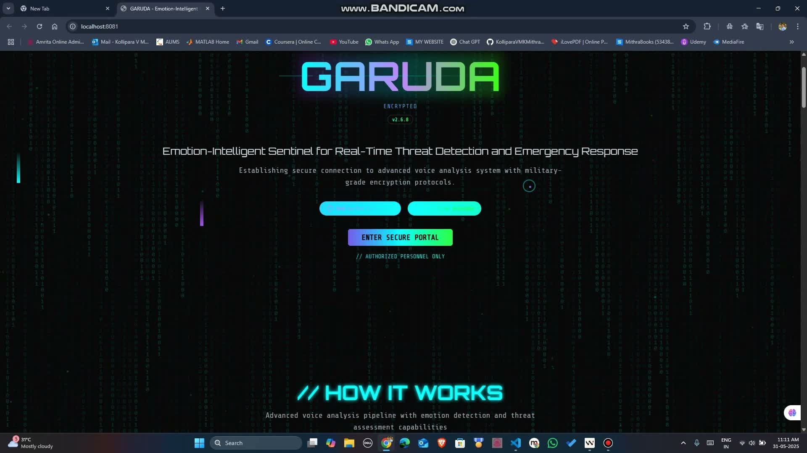
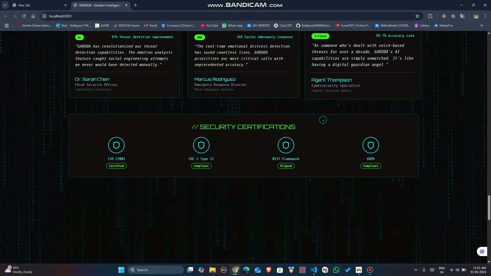
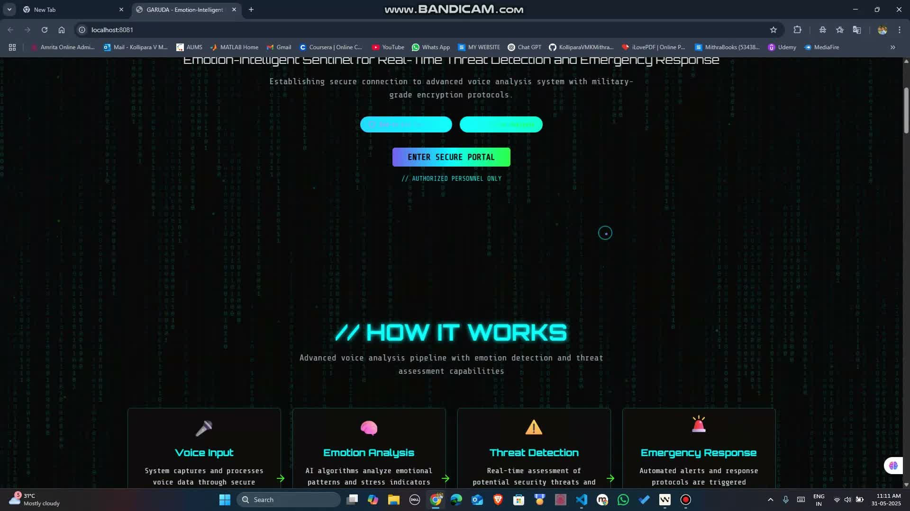

# GARUDA

<div align="center">

[](./docs/media/garuda-demo.mp4)

### Emotion-Intelligent Sentinel for Real-Time Voice Threat Detection

A cinematic cybersecurity showcase that blends a futuristic React product experience with a real-time voice communication prototype built for threat awareness, emotion analysis, and emergency-response storytelling.

[Watch Full Demo](./docs/media/garuda-demo.mp4) | [Open Frontend](./garuda-sentinel-core/) | [View Voice Prototype](./prototypes/voice-call-website/)


</div>

---

## Live Preview

The README now includes an inline motion preview so the repo feels alive on GitHub before anyone even clicks into the source.

[](./docs/media/garuda-demo.mp4)

## What Makes This Repo Stand Out

| Layer | Why it works |
| --- | --- |
| Brand and presentation | Strong cyberpunk identity, mythic GARUDA framing, premium visual tone |
| Frontend | React landing page with matrix rain, dynamic particles, scan lines, glowing panels, and dashboard-style sections |
| Prototype depth | A separate voice-call prototype adds real-time signaling and communication flow behind the concept |
| GitHub polish | Clickable banner, visible demo preview, screenshot gallery, and cleaned folder structure |

## Screenshot Gallery

| Hero Experience | Threat Dashboard |
| --- | --- |
| [](./docs/media/garuda-demo.mp4) | [](./docs/media/garuda-demo.mp4) |

| Workflow Section |
| --- |
| [](./docs/media/garuda-demo.mp4) |

## Repository Layout

```text
.
|-- garuda-sentinel-core/
|-- prototypes/
|   `-- voice-call-website/
|-- archive/
|   `-- amritapuri-first/
|-- docs/
|   |-- garuda-demo-poster.svg
|   |-- media/
|   |   |-- garuda-demo.mp4
|   |   `-- garuda-preview.gif
|   `-- screenshots/
|       |-- dashboard.jpg
|       |-- hero.jpg
|       `-- workflow.jpg
|-- .gitignore
`-- README.md
```

## Main Folders

### `garuda-sentinel-core`

This is the public-facing centerpiece of the repository.

- premium landing page
- secure-portal hero
- voice-analysis workflow
- cyber threat visualization
- testimonials and security positioning
- responsive React and Tailwind implementation

### `prototypes/voice-call-website`

This is the supporting prototype that gives the concept technical credibility.

- Express server
- Socket.IO signaling
- WebRTC audio call flow
- host approval process
- audio sharing support
- Twilio config moved to environment-based placeholders for safe public publishing

### `archive/amritapuri-first`

This folder keeps the earlier prototype accessible without crowding the main public repo view.

## Tech Stack

- React
- TypeScript
- Vite
- Tailwind CSS
- shadcn/ui
- Node.js
- Express
- Socket.IO
- WebRTC
- FFmpeg for demo asset generation and optimization

## Run Locally

### Frontend showcase

```bash
cd garuda-sentinel-core
npm install
npm run dev
```

Available at `http://localhost:8080`

### Voice-call prototype

```bash
cd prototypes/voice-call-website
npm install
npm start
```

Available at `http://localhost:3002`

## Demo Assets

- Full demo video: `docs/media/garuda-demo.mp4`
- Animated inline preview: `docs/media/garuda-preview.gif`
- Screenshots: `docs/screenshots/`

The original oversized demo was replaced with a compressed version to make the public repository more professional and easier to browse.

## Notes

- The repository has been cleaned so the strongest folders sit at the top level.
- Hardcoded secrets were removed before publishing.
- The archived prototype is still preserved, but the public view now emphasizes the best implementation first.

## Author

Built as a concept-driven cyber-defense experience inspired by vigilance, protection, and rapid response.
